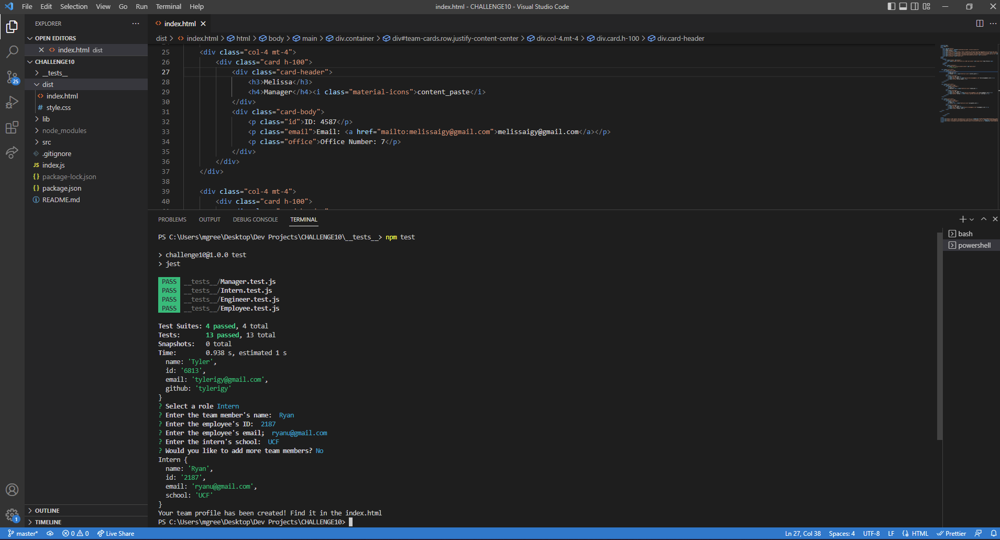

# Team Profile Generator

   
  ## Table-of-Contents
  * [Description](#description)
  * [Installation](#installation)
  * [Usage](#usage)
  * [Contributing](#contributing)
  * [Tests](#tests)
  * [Questions](#questions)
  
  ## [Description](#table-of-contents)
  This app is designed to streamline the process of creating a profile for a team of engineers and interns. The user can begin by adding the manager and simply go through the prompts to create a styled web application displaying important information about each employee.

  ## [Installation](#table-of-contents)
  Clone this repository to your local machine and install node.js
  ## [Usage](#table-of-contents)
  Once installed, using the terminal, enter 'node index.js' to begin answering the prompts. Once finished, a new index.html file will be available in the dist folder.
  View walkthrough video here - [Screencastify](https://drive.google.com/file/d/1AaYicRnUp9fCdStr1kCGvtoW08B0UGKs/view) 

  ## [Contributing](#table-of-contents)
  I am not accepting contributions at this time.
  ## [Tests](#table-of-contents)
  Run `npm test` to run Jest for tests on constructors. 
  ## [Questions](#table-of-contents)
  Please contact me using the following links:
  [GitHub](https://github.com/melissaigy)
  [Email: melissaigyarto@gmail.com](mailto:melissaigyarto@gmail.com)
